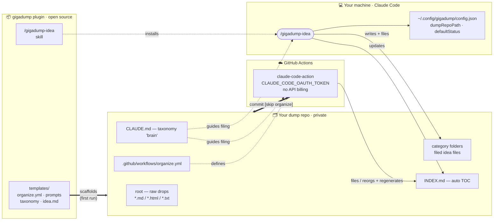
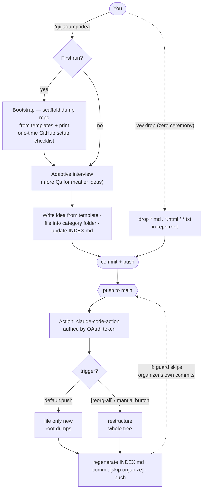

# gigadump

A self-organizing idea dump for Claude Code. Capture ideas with one command;
they get filed into a coherent folder tree with an auto-maintained `INDEX.md` —
organized in CI on your **Claude subscription** (OAuth token), with **no
pay-as-you-go API billing**.

## How it works

gigadump is split across **two repos**: the open-source **plugin** (machinery
only, no content) and your **private dump repo** (your ideas plus a copy of the
machinery). You capture locally on your Claude subscription; a GitHub Action
re-organizes in the cloud on the same subscription token.



**An idea's lifecycle** — two capture paths, one CI organizer:



## Install

```
/plugin marketplace add GigaFlow-AI-Incorporated/gigadump
/plugin install gigadump
```

## Use

Run `/gigadump-idea`. On first run it bootstraps your dump repo (asks where it
should live, scaffolds the workflow + conventions + templates, and prints a
one-time GitHub setup checklist). After that, every run:

1. Runs a short, adaptive interview (more questions for meatier ideas, fewer for
   quick seeds).
2. Writes a structured idea file and files it into the right category folder.
3. Updates `INDEX.md`.

Then you `commit` + `push`. You can also just drop a raw `.md`/`.html`/`.txt`
file in your dump repo's root and push — a GitHub Action files it for you.

## How organizing works

The bootstrap installs a GitHub Action in your dump repo. On push to `main` it
organizes new root files; with `[reorg-all]` in the commit message (or the
manual **Run workflow** button) it restructures the whole tree. It authenticates
with a `CLAUDE_CODE_OAUTH_TOKEN` secret you generate via `claude setup-token`.

## Config

Per-user state lives in `~/.config/gigadump/config.json`
(`{ "dumpRepoPath": "...", "defaultStatus": "seed" }`).

## License

MIT
